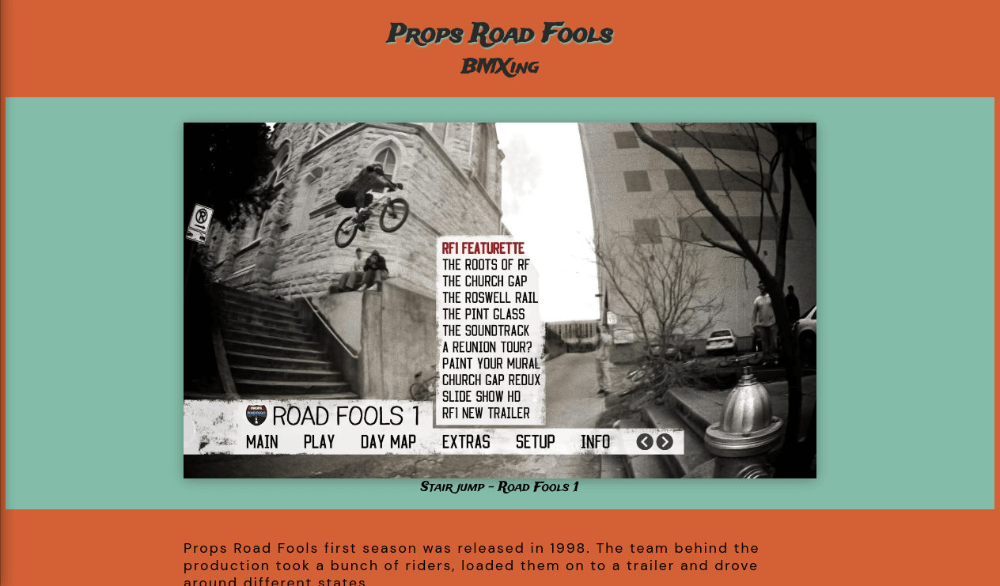

# Soc Tribute Page

A one page tribute page to Props Road Fools BMXing documentary.

## Features

- Fully responsive

## Purpose

The creation of this project was part of the application process to join the School of Code bootcamp.

**Learning Journey step 7**

You will now be using git and vscode to:

  * _clone_ your repository to your local machine (use the HTTPS link)

  * _update_ the sample HTML and CSS files with your own code (from CodePen) 

  * _add, commit and push_ your changes to your brand new repository. Pretty cool eh?

**Deploy the site using GitHub pages**

Follow the guide [HERE](https://docs.github.com/en/pages/getting-started-with-github-pages/creating-a-github-pages-site)

Make sure that the deployed branch is `main` in settings.

## Screenshots

## Color Reference

| Color             | Hex                                                                |
| ----------------- | ------------------------------------------------------------------ |
| Dark grey |  #282B28 |
| Olive kinda|  #83BCA9 |
| Orange |  #D36135 |

## Tech Stack

**Client:** HTML5 and CSS3

## Acknowledgements

 - [Red Bull](https://img.redbull.com/images/c_limit,w_1500,h_1000,f_auto,q_auto/redbullcom/2013/09/13/1331611158318_2/road-fools-1-menu-from-the-props-box-set) for hosting the, DVD cover, image.
 - [School of Code](https://www.schoolofcode.co.uk/) for providing this little fun task.
 - [Google Fonts](https://fonts.google.com/)

## Authors

- [Carlos E Alford](https://carlosealford.com/)

## License

[MIT](https://choosealicense.com/licenses/mit/)

---

