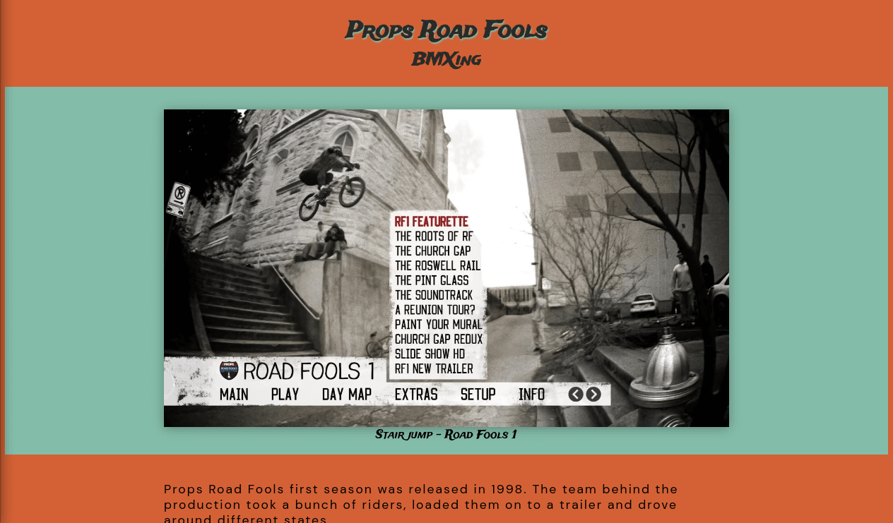

# Soc Tribute Page :bike:

A one page tribute page to Props Road Fools BMXing documentary.

:bike: [Live Site](https://webshuriken.github.io/SOC-tribute-page/)

## Features

- Fully responsive

## About

The creation of this project was part of the application process to join the School of Code bootcamp. To which I was ACCEPTED! :fire: very exiting to have a platform to help me keep moving towards my goal of joining the large world of web development.

## Tech Stack

- HTML5
- CSS3

## Acknowledgements

 - [Red Bull](https://img.redbull.com/images/c_limit,w_1500,h_1000,f_auto,q_auto/redbullcom/2013/09/13/1331611158318_2/road-fools-1-menu-from-the-props-box-set) for hosting the, DVD cover, image.
 - [School of Code](https://www.schoolofcode.co.uk/) for providing this little fun task.
 - [Google Fonts](https://fonts.google.com/)

## Authors

- [Carlos E Alford](https://carlosealford.com/)

## License

[MIT](LICENSE)
